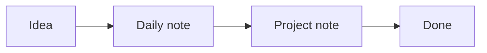

# Writing notes

Notes are plain Markdown files, so they open just as well in any other editor.
Switch between the editor and the preview from the toolbar.

## Formatting

**Bold**, *italic*, `inline code`, and
[links to the web](https://commonmark.org).

| Feature | Syntax       |
| ------- | ------------ |
| Heading | `## Heading` |
| Task    | `- [ ] Task` |
| Callout | `> [!note]`  |

## Callouts

> [!note] A note
> Callouts are block quotes that start with a type.

> [!idea]
> Also available: `info`, `warning`, `error`, `deadline`, `tldr`, `code`,
> and `prompt`.

## Math

Inline math such as $E = mc^2$, and display math:

$$
\int_0^\infty e^{-x^2}\,dx = \frac{\sqrt{\pi}}{2}
$$

## Diagrams

## Images

Paste or drop an image into the editor and WebMD saves it to the workspace's
image folder and links it. This one is already in `/assets`:

![[garden-beds.svg]]

## Snippets

Type `/date`, `/today`, `/task`, or `/meeting` and press Tab.

## Related

- [[Links and the graph]]
